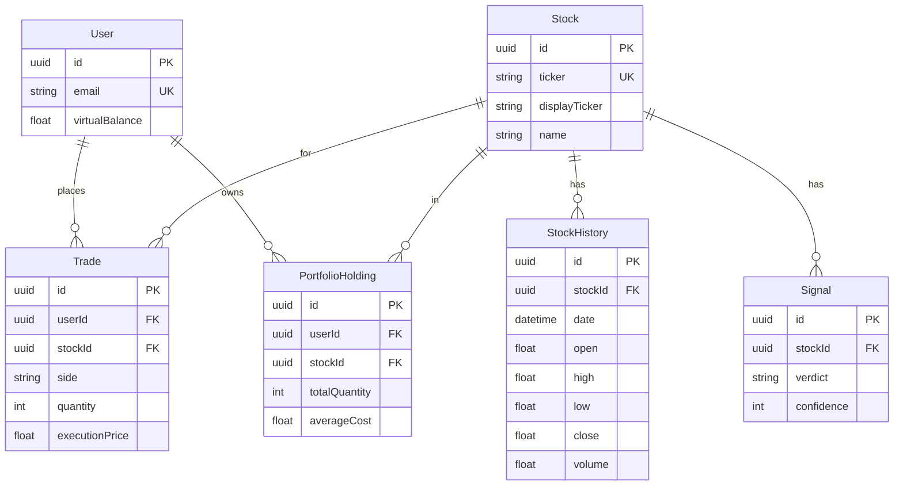

# Database ER diagram & user flow

## Entity–relationship diagram (Prisma / PostgreSQL)

Render the Mermaid block in GitHub, VS Code (Mermaid preview), or [mermaid.live](https://mermaid.live).

**Notes**

- Diagram shows the **core investing spine** only: identity, instruments, price history, simulated trades, positions, and ML signals. **Prisma also includes** forum (questions, answers, votes), tribes (channels, messages, polls), watchlist, sentiment votes, feed events, notifications, follows, news articles, leaderboard snapshots, and RAG `Document` rows — see `server/prisma/schema.prisma` for full models and relations.
- **Signal** is keyed off **Stock** (no `User` FK); the app reads the latest rows per ticker for the dashboard.

---

## User flow (six bullets)

1. **Land → sign up** — User hits the marketing **landing**, then **registers or signs in** and lands on **`/app`** (dashboard).

2. **Discover & watch** — User browses **stocks**, charts, and **signals**, optionally adds symbols to **watchlist** or checks **sentiment**.

3. **Trade (simulated)** — User executes **BUY / SELL**; the system writes **Trade** rows, updates **PortfolioHolding** / virtual balance, and may create **FeedEvent** and **notifications**.

4. **Engage socially** — User joins **Tribe** channels (chat / polls), posts or reads **Forum** Q&A, and votes on questions or answers.

5. **Stay informed** — User sees dashboard **feed** (anonymized activity), **news** from `NewsArticle`, and in-app **notifications** for signals or activity.

6. **Measure progress** — User reviews **portfolio** performance and **leaderboard** snapshots (weekly / monthly / all-time); may use **time-machine** flow with historical prices from **StockHistory**.
